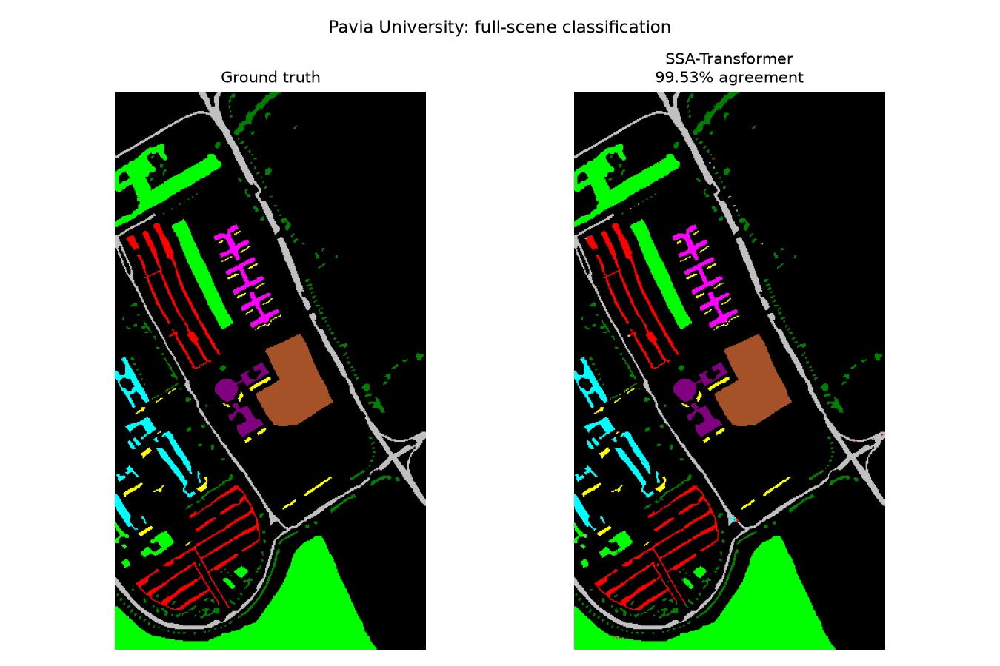
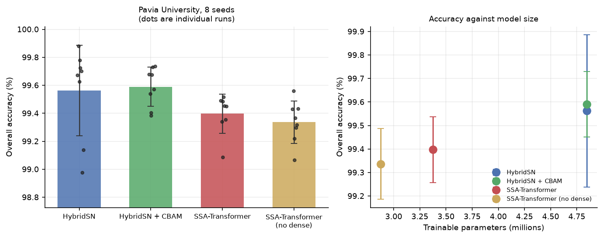
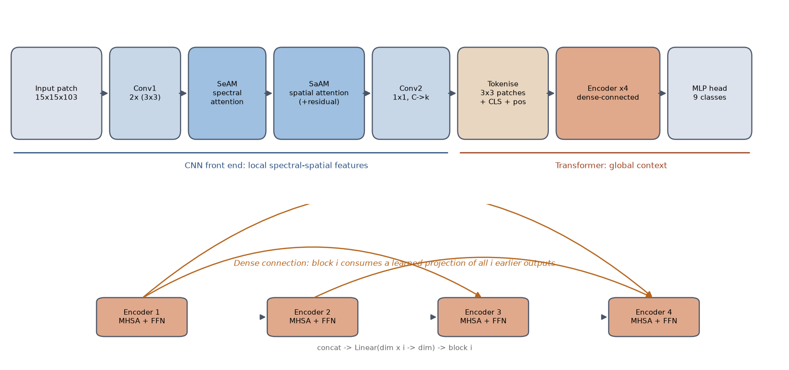
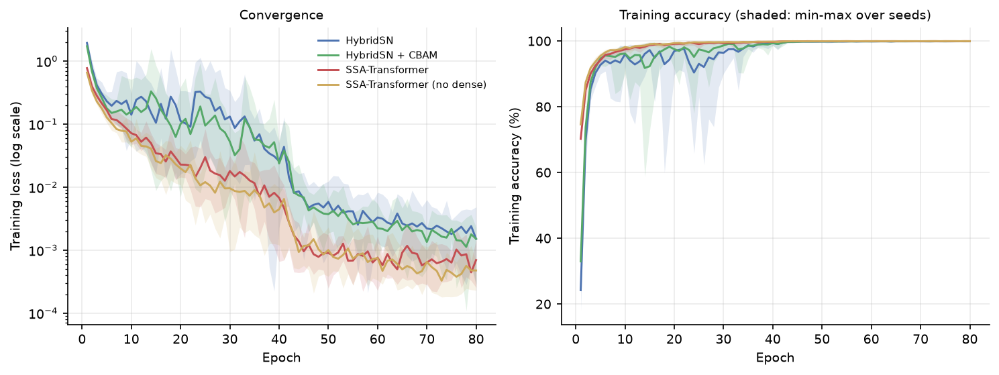
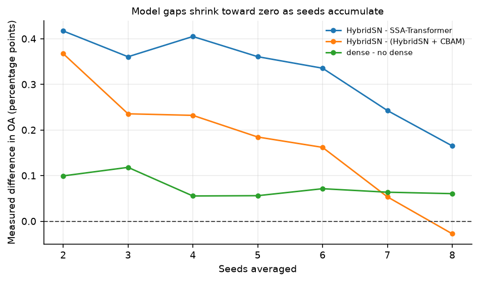
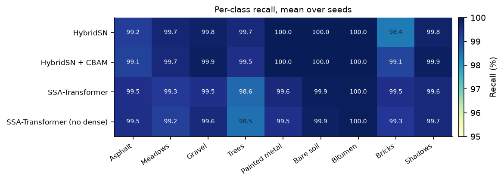

# Spectral–Spatial Attention Transformer for Hyperspectral Image Classification

A PyTorch implementation and reproducibility study of **SSA-Transformer**
(Dang et al., *Computational Intelligence and Neuroscience*, 2022,
[doi:10.1155/2022/7071485][paper]), benchmarked on Pavia University against
HybridSN and HybridSN+CBAM under an identical evaluation protocol.

The headline is a negative result, reached carefully: **on this scene, none of
the architectural differences between these four models survives the
seed-to-seed variation** — including the dense connection the paper proposes.

[paper]: https://doi.org/10.1155/2022/7071485



*SSA-Transformer applied to every labelled pixel of the scene, trained on 400 pixels
per class (8.4% of the labels).*



---

## Why this study

Hyperspectral benchmarks are saturated. Published overall accuracies on Pavia
University cluster above 99%, which leaves differences between methods measured
in tenths of a percentage point — the same order as the noise between two runs
of the *same* model with different random seeds. Papers routinely report a
single run, or report a mean without a spread.

This repository asks a narrower question than "which model is best":

> Given a fixed evaluation protocol and repeated runs, **which of these
> architectural choices produce a difference large enough to detect at all?**

## Method

### Data and sampling

Pavia University: a 610 × 340 ROSIS scene, 103 spectral bands after noisy-band
removal, 9 land-cover classes and 42,776 labelled pixels. Each labelled pixel
becomes a square patch centred on it, labelled by its centre.

Two sampling protocols are implemented, and the choice matters more than any
model in this study:

| Protocol | Training set | Test set |
|---|---|---|
| `fixed` *(default)* | 400 pixels per class = 3,600 (8.4%) | 39,176 |
| `ratio` | 30% of all labelled pixels | 70% |

Patches overlap: a 15 × 15 patch shares pixels with every neighbour within seven
pixels, so no split of a single scene is fully independent. `ratio` makes that
overlap near-total and inflates results accordingly — HybridSN reaches 99.97%
under `ratio` against 99.56% under `fixed`. All results below use `fixed`, the
stricter protocol and the one Dang et al. adopt.

Spectral preprocessing is per-band standardisation, optionally followed by PCA.
PCA is applied **without whitening** and rescaled by a single global factor.
Whitening, or per-component standardisation, gives every component unit variance
and so amplifies the low-variance components — largely sensor noise — into
outliers beyond 100σ; deep CNNs fed such inputs diverge within a few epochs into
a dead-ReLU state at exactly ln(C).

### Architectures

**SSA-Transformer** combines a convolutional attention front end with a
dense-connected transformer encoder, following equations (1)–(8) of the paper:



```
y'    = Conv1(y)              two 3×3 convolutions, spectral depth preserved
y''   = Mse(y') ⊙ y'          spectral attention   (SeAM, eq. 2–3)
y'''  = Msa(y'') ⊙ y'' + y    spatial attention, residual to input (SaAM, eq. 4–5)
y'''' = Conv2(y''')           one 1×1 convolution, C → k
```

The resulting map is cut into non-overlapping p × p patches (p = 3), each
flattened to a p·p·k token, prepended with a class token and given learned
position codes. Encoder blocks use pre-norm multi-head self-attention and a GeLU
feed-forward network, and are wired with **dense connections**: block *i*
consumes a learned projection of the concatenated outputs of all *i* preceding
blocks, rather than only its immediate predecessor.

The paper leaves two quantities unstated; both are exposed as configuration and
default to encoder depth 4 and retained bands k = 32.

**HybridSN** (Roy et al., GRSL 2020) stacks three 3D convolutions, folds the
spectral and channel axes together, and applies a 2D convolution. The **+CBAM**
variant inserts a Convolutional Block Attention Module (Woo et al., ECCV 2018)
after each 3D stage.

### Training

Identical for every model: SGD with momentum 0.9, learning rate 0.01 decaying to
0.001 at epoch 41, 80 epochs, batch size 32, cross-entropy loss. Each model
otherwise keeps the input geometry it was designed for — HybridSN 25 × 25
patches over 15 PCA bands, SSA-Transformer 15 × 15 over all 103 bands.

Every configuration is run with **8 random seeds**, which control both
initialisation and the choice of training pixels.

## Results

| Model | Split | Seeds | Params | OA (%) | AA (%) | Kappa (%) |
|---|---|---:|---:|---|---|---|
| HybridSN | fixed | 8 | 4,844,793 | 99.56 ± 0.32 | 99.62 ± 0.21 | 99.40 ± 0.44 |
| HybridSN + CBAM | fixed | 8 | 4,845,489 | 99.59 ± 0.14 | 99.68 ± 0.08 | 99.44 ± 0.19 |
| SSA-Transformer | fixed | 8 | 3,374,019 | 99.40 ± 0.14 | 99.49 ± 0.06 | 99.17 ± 0.19 |
| SSA-Transformer (no dense) | fixed | 8 | 2,875,491 | 99.34 ± 0.15 | 99.45 ± 0.12 | 99.09 ± 0.21 |
| HybridSN | ratio | 1 | 4,844,793 | 99.97 | 99.87 | 99.96 |

SSA-Transformer reaches 99.40% with **30% fewer parameters** than HybridSN, and
reproduces close to the 99.69% the paper reports.



All four models converge to a training loss below 0.01 and none diverges, so the
spread in the table is genuine variation in generalisation rather than unstable
optimisation.

### Which differences are real?

Welch two-sided t-tests on overall accuracy, n = 8 per group:

| Comparison | Δ OA | p | Verdict |
|---|---:|---:|---|
| HybridSN vs HybridSN + CBAM | −0.03 | 0.830 | not distinguishable |
| SSA-Transformer, dense vs not | +0.06 | 0.419 | not distinguishable |
| HybridSN vs SSA-Transformer | +0.17 | 0.216 | not distinguishable |

**None of the three survives**, including the paper's dense-connection claim.

This is not a conclusion that could have been reached from a small number of
runs, and the figure below is the reason:



Every measured gap drifts toward zero as seeds accumulate. At three seeds the
HybridSN-over-SSA-Transformer gap looked large and significant (+0.36, p = 0.006);
by eight seeds it is +0.17 and indistinguishable. The CBAM gap changes sign
entirely. Two or three runs on this benchmark are enough to produce a confident
conclusion in either direction.

### Full-scene inference

Applying the trained model to every labelled pixel reproduces the reference map
to 99.53% agreement. Residual errors concentrate on class boundaries, which is
what patch-based classification predicts: a patch straddling two classes carries
mixed evidence for its centre pixel.

### Per-class behaviour



The aggregate numbers hide a consistent split. The transformers are weaker on
Trees (98.6% against 99.7%) but stronger on Asphalt and Bricks, suggesting the
global self-attention helps on the spectrally ambiguous built-up classes and
hurts on vegetation, where local texture carries the signal. CBAM's clearest
effect is on Bricks, 98.4% → 99.1%, the hardest class for plain HybridSN.

### An open question

HybridSN's spread is more than twice CBAM's (σ 0.32 vs 0.14, a 5.4× variance
ratio), which would suggest CBAM buys *stability* rather than accuracy. The
evidence is not conclusive — Bartlett's test gives p = 0.040 but the
normality-free Levene's test gives p = 0.356, and the HybridSN samples contain a
low outlier. More seeds would settle it.

## Layout

```
src/hsi_ssat/
  data.py                  patch extraction, both sampling protocols
  metrics.py               OA / AA / Kappa
  train.py                 training and evaluation entry point
  models/
    hybridsn.py            HybridSN and its CBAM variant
    ssa_transformer.py     SSA-Transformer
scripts/
  run_pavia.sh             the benchmark sweep
  run_seeds.sh             seed repeats
  summarise.py             aggregate table and significance tests
  make_figures.py          every figure in this README
  predict_map.py           full-scene classification map
tests/                     shape, logit and split-protocol invariants
reports/                   one JSON record per run
```

## Running

```bash
uv sync
uv run python -m hsi_ssat.train --model ssa_transformer \
    --window 15 --pca-components 0 --protocol fixed --per-class 400 --epochs 80
```

Full sweep, then the table and figures:

```bash
GROUP=cnn ./scripts/run_pavia.sh && GROUP=transformer ./scripts/run_pavia.sh
GROUP=cnn ./scripts/run_seeds.sh && GROUP=transformer ./scripts/run_seeds.sh
uv run python scripts/summarise.py --compare
uv run python scripts/make_figures.py
```

Pavia University (`PaviaU.mat`, `PaviaU_gt.mat`) goes in `data/`; it is a public
benchmark and is not redistributed here.

## References

- Dang, Weng, Dong, Li, Hou. *Spectral-Spatial Attention Transformer with Dense
  Connection for Hyperspectral Image Classification.* CIN, 2022.
- Roy, Krishna, Dubey, Chaudhuri. *HybridSN: Exploring 3-D–2-D CNN Feature
  Hierarchy for Hyperspectral Image Classification.* IEEE GRSL, 2020.
- Woo, Park, Lee, Kweon. *CBAM: Convolutional Block Attention Module.* ECCV, 2018.
- Nalepa, Myller, Kawulok. *Validating Hyperspectral Image Segmentation.*
  IEEE GRSL, 2019.
